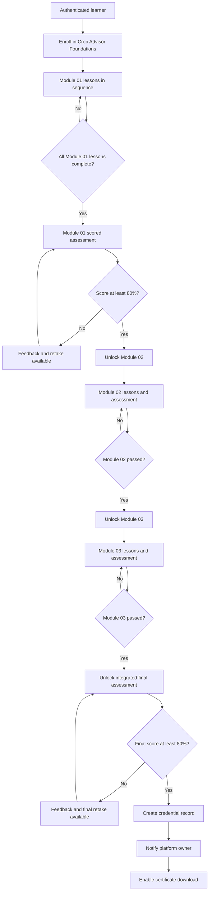

# Crop Advisor Foundations: Training Design Package

**Author:** Manus AI  
**Version:** 1.0  
**Delivery format:** LMS-ready Markdown specification with matching application implementation

## Purpose and learner outcome

Crop Advisor Foundations is a four-hour, self-paced professional learning pathway for agricultural practitioners who need a repeatable approach to field observation, soil context, crop diagnosis, and defensible recommendation-making. The programme is designed around applied judgement rather than product selection. Learners proceed through three required modules, complete scored module assessments, and then pass an integrated final assessment before a credential is issued.

> **Credential standard:** A learner must complete every lesson, pass each module assessment, and score at least **80%** on the final integrated assessment before a certificate is created.

## Module architecture

| Module | Professional capability | Learning objectives | Lessons | Gate to next requirement |
|---|---|---|---|---|
| **01. Advisory practice** | Turning a field observation into transparent, risk-aware advice. | Distinguish observations, interpretations, and recommendations; define the evidence needed for a field question; keep a traceable recommendation record; recognise when escalation is appropriate. | **Observe, frame, decide**; **Stewardship, records, and risk** | Both lessons complete and module check passed at 80% or above. |
| **02. Soil and nutrition** | Interpreting soil context and collecting representative evidence. | Relate rooting and water conditions to crop performance; identify field zones; design a representative sample; state the assumptions behind nutrient advice. | **Read the soil profile in context**; **From sampling to recommendation** | Both lessons complete and module check passed at 80% or above. |
| **03. Crop observation** | Scouting by growth stage and diagnosing field variability. | Prioritise field observations by crop stage; separate incidence from severity; test competing explanations; communicate certainty proportionately. | **Scout by growth stage**; **Diagnose field variability** | Both lessons complete and module check passed at 80% or above. |

Each lesson contains a short applied introduction, three substantial content sections, an explicit learning-outcome panel, a field-practice callout, contextual navigation, and a completion control. The interface preserves the lesson order within a module and gives learners a visible record of completion.

## Authored lesson content map

| Lesson | Granular outline | Applied learning cue |
|---|---|---|
| **Observe, frame, decide** | Start with a decision-focused field question; compare affected and unaffected zones; create an auditable recommendation. | Record what is seen, where it occurs, and how it varies before explaining why it happened. |
| **Stewardship, records, and risk** | Keep a complete advisory record; identify operational and stewardship constraints; close the loop with follow-up. | State the conditions that would cause a recommendation to change. |
| **Read the soil profile in context** | Inspect rooting and soil structure; separate distinct management zones; identify dominant limits before recommending nutrients. | Pair laboratory data with field description of roots and water conditions. |
| **From sampling to recommendation** | Design a sample for the decision; protect sample integrity; explain recommendation assumptions and checks. | Sampling error can be a larger practical risk than small laboratory-number differences. |
| **Scout by growth stage** | Use crop stage to plan visits; walk for field contrast; distinguish incidence from severity. | Link stage, distribution, incidence, severity, and plausible driver. |
| **Diagnose field variability** | Use spatial pattern as a clue; test competing explanations; communicate diagnostic certainty honestly. | A diagnosis should be a transparent argument that links evidence to the next decision. |

## Assessment package

The assessment design uses unambiguous, single-best-answer multiple-choice items with applied field contexts. Immediate feedback explains why the selected response was right or why another action should be taken. A learner can retake an assessment after reviewing the feedback; passing status is retained for progression.

| Assessment | Scope | Items | Pass mark | Decision rule |
|---|---:|---:|---:|---|
| **Advisory practice check** | Field pattern comparison, record traceability, appropriate escalation. | 3 | 80% | Unlocks Soil and nutrition only after both Module 01 lessons are complete and the check is passed. |
| **Soil and nutrition check** | Root-zone context, management-zone sampling, prevention of sampling bias. | 3 | 80% | Unlocks Crop observation only after both Module 02 lessons are complete and the check is passed. |
| **Crop observation check** | Growth-stage scouting, interpreting spatial patterns, evidence-limited diagnosis. | 3 | 80% | Unlocks the integrated final assessment only after both Module 03 lessons are complete and the check is passed. |
| **Final integrated assessment** | Advisory sequence, soil context, management-zone evidence, uncertainty management. | 4 | 80% | Issues certificate after a pass; a new certificate event triggers an owner notification. |

### Scoring rubric

| Result band | Score | System outcome | Learner feedback pattern |
|---|---:|---|---|
| **Requirement met** | 80–100% | Assessment completion is recorded. The relevant next activity is unlocked. For a final-assessment pass, a certificate is issued. | Confirm applied competence and direct the learner to the next requirement or certificate. |
| **Review and retry** | 0–79% | Assessment attempt is recorded, but the gate remains closed. Retakes remain available. | Identify the concept that needs review and return the learner to the relevant learning route. |

## Final test blueprint

| Item objective | Scenario focus | Evidence of mastery | Correct decision construct |
|---|---|---|---|
| **Integrate crop and soil evidence** | Pale cereal in a poorly drained depression. | Identifies plant, root, soil, moisture, and management evidence required before intervention. | Compare root and soil condition, water status, healthy plants, and history. |
| **Sequence advisory practice** | General field-advisory decision. | Orders observation, decision framing, evidence collection, constrained advice, and follow-up. | Use the complete evidence-led advisory sequence. |
| **Represent a management zone** | Soil sampling across distinct field positions. | Connects sample design with a spatially specific decision. | Keep distinct zones separate when management may differ. |
| **Manage uncertainty proportionately** | Plausible but incompletely evidenced diagnosis. | Chooses verification or specialist input before a high-consequence action. | State uncertainty and seek decisive evidence or expertise. |

## Certificate template specification

The certificate is presented within the credential route and can be downloaded as a vector SVG file. Its visual treatment uses a formal cream substrate, deep-green double-rule border, institute emblem, credential seal, issue date, final score, and a unique verification-ready credential identifier.

| Customization field | Source | Display position |
|---|---|---|
| **Recipient name** | Authenticated learner profile | Primary certificate line |
| **Credential title** | Course configuration | Credential statement |
| **Final assessment score** | Passed final-assessment attempt | Credential evidence line |
| **Issue date** | Certificate creation timestamp | Credential evidence line |
| **Credential ID** | Generated at issuance | Verification line and filename |

## Progression and assessment logic

## Platform UI and UX direction

The implemented visual system is a **quiet agrarian academy**. It uses deep field green as the authority colour, soft sage as the learning-support colour, cream as the reading surface, and restrained soil-gold as a credential and gated-state accent. Typography pairs an editorial serif for learning and credential hierarchy with a highly legible sans serif for dense guidance, navigation, and assessment feedback.

| Element | Implementation guidance |
|---|---|
| **Navigation** | Persistent top navigation maintains access to Dashboard, Curriculum, and Credential routes. Every subpage provides an explicit path back to the dashboard or learning route. |
| **Progress** | Module cards, a completion ring, and a next-required-activity panel make the learner’s state legible without turning the platform into a game. |
| **Gates** | Locked states use a warm, restrained lock icon and direct explanation of the prerequisite; they do not obscure what is required. |
| **Assessment feedback** | Results distinguish pass versus review-and-retry, show score and correct-count evidence, then give item-level feedback. |
| **Accessibility** | Buttons are semantic controls, keyboard reachable, and maintain focus indicators. Visual states are reinforced with text and icons rather than colour alone. |
| **Responsive behaviour** | The desktop three-column lesson view folds to a single instructional sequence on mobile while retaining module navigation and completion controls. |

## Data and operational workflow

The platform persists enrollment, individual lesson completion, assessment attempts, and issued certificates. Assessment availability is calculated from stored completion and passing records rather than trusting client-side navigation. A final assessment pass creates a single certificate for the learner-course pair and marks the enrollment complete. On first issuance only, the server sends the platform owner an operational alert containing the learner name, score, and credential ID.
