# Crop Advisor Foundations: Training Design Package

**Author:** Manus AI  
**Version:** 2.8  
**Delivery format:** LMS-ready Markdown specification with matching application implementation

## Purpose and learner outcome

Crop Advisor Foundations is a sixteen-hour, self-paced professional learning pathway for agricultural practitioners who need a repeatable approach to field observation, soil context, crop diagnosis, vegetable-production planning, cost planning, crop-and-variety selection, crop-yield factors, climatic risk, topographic risk, edaphic soil health, soil-protection planning, balanced plant nutrition, integrated nutrient management, acid-soil management, soil-health promotion, representative soil-sample collection, protected vegetable-nursery management, open-field bare-root seedling production, protected cellular seedling production, seedling-production planning, field preparation, mulching, trellising, and defensible recommendation-making. The programme is designed around applied judgement rather than product selection. Learners proceed through twenty-one required modules, complete scored module assessments, and then pass an integrated final assessment before a credential is issued.

> **Credential standard:** A learner must complete every lesson, pass each module assessment, and score at least **80%** on the final integrated assessment before a certificate is created.

## Module architecture

| Module | Professional capability | Learning objectives | Lessons | Gate to next requirement |
|---|---|---|---|---|
| **01. Advisory practice** | Turning a field observation into transparent, risk-aware advice. | Distinguish observations, interpretations, and recommendations; define the evidence needed for a field question; keep a traceable recommendation record; recognise when escalation is appropriate. | **Observe, frame, decide**; **Stewardship, records, and risk** | Both lessons complete and module check passed at 80% or above. |
| **02. Soil and nutrition** | Interpreting soil context and collecting representative evidence. | Relate rooting and water conditions to crop performance; identify field zones; design a representative sample; state the assumptions behind nutrient advice. | **Read the soil profile in context**; **From sampling to recommendation** | Both lessons complete and module check passed at 80% or above. |
| **03. Crop observation** | Scouting by growth stage and diagnosing field variability. | Prioritise field observations by crop stage; separate incidence from severity; test competing explanations; communicate certainty proportionately. | **Scout by growth stage**; **Diagnose field variability** | Both lessons complete and module check passed at 80% or above. |
| **04. Vegetable production planning** | Building a whole-system vegetable plan from farm context and site appraisal. | Identify the climatic, edaphic, topographic, economic, biological, and knowledge factors affecting the plan; develop a rich picture; turn site evidence into crop, layout, irrigation, and checklist decisions. | **Build the rich picture**; **Turn a site appraisal into a field plan** | Both lessons complete and module check passed at 80% or above. |
| **05. Cost planning and decisions** | Turning a field objective into a resource, cost, return, and revision decision. | Define a measurable production objective; estimate crop-scale and activity needs; compute input quantities and locally relevant costs; compare plausible returns with costs and revise a weak plan. | **Set objectives and map activities**; **Compute costs and test returns** | Both lessons complete and module check passed at 80% or above. |
| **06. Crop and variety selection** | Choosing a crop and variety through family, rotation, market, site, season, and farmer-participation criteria. | Identify major crop families; use rotation to reduce repeat-crop risks; define buyer preference; test local adaptability; agree a selection with the farmer using reliable information. | **Use crop families to plan rotation**; **Match variety to market and site** | Both lessons complete and module check passed at 80% or above. |
| **07. Factors affecting crop yield** | Relating seed genetics, climate, soil, and topography to yield potential and adaptation. | Distinguish genetic from environmental factors; choose seed traits for an objective; identify climatic, edaphic, and topographic factors; use their interaction to plan adaptation. | **Match seed genetics to the production goal**; **Read environmental yield factors** | Both lessons complete and module check passed at 80% or above. |
| **08. Climatic factors and crop yield** | Applying light, temperature, water, air, humidity, and wind evidence to seasonal crop planning and climate-risk management. | Classify light and temperature fit; align water supply with crop stage; interpret air and humidity signals; reduce damaging wind stress; build a locally relevant crop calendar. | **Plan with light and temperature**; **Manage water, air, humidity, and wind** | Both lessons complete and module check passed at 80% or above. |
| **09. Topographic factors and crop yield** | Using elevation, slope, landform, and site mapping to manage water, erosion, crop fit, and field-placement risk. | Identify landform features; test elevation and variety fit; interpret slope and water movement; design erosion controls; create a practical topographic farm sketch. | **Read elevation and landform**; **Map slope, water, and farm risk** | Both lessons complete and module check passed at 80% or above. |
| **10. Edaphic soil factors and crop yield** | Assessing physical, chemical, and biological soil properties to identify root-zone limits and soil-improvement decisions. | Assess structure, texture, and colour; interpret pH and CEC; recognise soil life and organic matter; prepare a complete assessment with the farmer. | **Assess physical soil properties**; **Interpret chemical and biological soil health** | Both lessons complete and module check passed at 80% or above. |
| **11. Soil degradation and management** | Identifying degradation risks and designing practical soil-conservation strategies. | Distinguish major degradation processes; identify likely causes; match risks with protection measures; present feasible risk-reduction actions with the farmer. | **Recognise soil degradation risks**; **Build a soil-protection plan** | Both lessons complete and module check passed at 80% or above. |
| **12. Nutrients required in plant nutrition** | Classifying essential nutrients and using source, mobility, function, and availability evidence for balanced crop nutrition. | Distinguish nutrition from fertilisation; classify macro and micronutrients; interpret mobility; link nutrient functions with crop performance; use soil evidence before input decisions. | **Map essential nutrients and sources**; **Translate nutrient roles into field decisions** | Both lessons complete and module check passed at 80% or above. |
| **13. Nutrient management** | Diagnosing nutrient-risk patterns and building integrated plans that supply, retain, recycle, and protect nutrients. | Diagnose patterns by leaf age and symptom; check soil nutrient status and pH; map supply and loss pathways; select integrated nutrient-management actions. | **Diagnose nutrient imbalance methodically**; **Build an integrated nutrient-management plan** | Both lessons complete and module check passed at 80% or above. |
| **14. Acid soil causes and management** | Diagnosing acidification, confirming pH, and selecting liming and complementary practices responsibly. | Explain acidification; identify acid-soil characteristics and causes; measure pH appropriately; select liming and supporting management; avoid overliming. | **Diagnose acid soil and pH risk**; **Measure and manage acid soil** | Both lessons complete and module check passed at 80% or above. |
| **15. How to promote soil health** | Assessing soil as a living system and selecting practical practices that build resilience, function, and yield. | Integrate physical, chemical, and biological testing; improve structure, biology, water, and nutrients; use rotation, cover, organic matter, and crop-soil fit. | **Test the living soil system**; **Build soil health with living practices** | Both lessons complete and module check passed at 80% or above. |
| **16. Collect soil samples for soil testing** | Producing a representative, traceable soil sample that supports defensible fertiliser and crop-management decisions. | Explain testing purpose and timing; define homogeneous areas; collect and prepare representative composites; record crop and management context for interpretation. | **Plan a representative soil sample**; **Collect, prepare, and label the composite** | Both lessons complete and module check passed at 80% or above. |
| **17. Nursery for vegetable production** | Recognising high-quality seedlings and building a practical protected nursery for reliable establishment. | Assess root-system quality and stress; improve spacing, soil, drainage, and light; protect seedlings from rain, intense sun, contamination, and insect entry; decide transplant readiness. | **Recognise a high-quality seedling**; **Build and protect an improved nursery** | Both lessons complete and module check passed at 80% or above. |
| **18. Open-field seedling production** | Producing, protecting, hardening, and transplanting vigorous bare-root seedlings for field establishment. | Select and prepare the nursery site; sow thinly; adapt weather protection; harden seedlings; transplant with minimum root injury; manage pests and diseases through daily monitoring. | **Prepare and sow a bare-root nursery**; **Protect, harden, and transplant bare-root seedlings** | Both lessons complete and module check passed at 80% or above. |
| **19. Protective and cellular seedling production** | Producing uniform, protected cellular transplants with clean media, controlled germination, responsive care, hardening, and quality assurance. | Select a container and cell size; prepare and sterilise media; sow and protect seedlings; manage moisture and nutrition; harden and assess field readiness. | **Prepare cellular media and sow for uniformity**; **Manage protected germination and transplant readiness** | Both lessons complete and module check passed at 80% or above. |
| **20. Seedling production planning** | Planning seedling production from seed quality and layout through media, production method, nutrients, and protected nursery conditions. | Verify seed quality and treatment; compare hybrid and open-pollinated seed; calculate seedling needs; select media and method; integrate nutrients and nursery protection. | **Select quality seed and compute seedling needs**; **Plan media, method, and nutrition for the nursery** | Both lessons complete and module check passed at 80% or above. |
| **21. Field preparation, mulching, and trellising** | Creating a productive, well-drained crop environment and using mulch and trellises to protect soil, manage water, support plants, and improve field work. | Assess the field; clear and lay out beds; form raised beds and drainage; install mulch responsibly; time trellises for crop family and operations. | **Prepare the field and raised beds**; **Use mulch and trellises as crop-management systems** | Both lessons complete and module check passed at 80% or above. |

Each lesson contains a short applied introduction, three substantial content sections, an explicit learning-outcome panel, a field-practice callout, contextual navigation, and a completion control. The interface preserves the lesson order within a module and gives learners a visible record of completion.

## Authored lesson content map

| Lesson | Granular outline | Applied learning cue |
|---|---|---|
| **Observe, frame, decide** | Start with a decision-focused field question; compare affected and unaffected zones; create an auditable recommendation. | Record what is seen, where it occurs, and how it varies before explaining why it happened. |
| **Stewardship, records, and risk** | Keep a complete advisory record; identify operational and stewardship constraints; close the loop with follow-up. | State the conditions that would cause a recommendation to change. |
| **Read the soil profile in context** | Inspect rooting and soil structure; separate distinct management zones; identify dominant limits before recommending nutrients. | Pair laboratory data with field description of roots and water conditions. |
| **From sampling to recommendation** | Design a sample for the decision; protect sample integrity; explain recommendation assumptions and checks. | Sampling error can be a larger practical risk than small laboratory-number differences. |
| **Scout by growth stage** | Use crop stage to plan visits; walk for field contrast; distinguish incidence from severity. | Link stage, distribution, incidence, severity, and plausible driver. |
| **Diagnose field variability** | Use spatial pattern as a clue; test competing explanations; communicate diagnostic certainty honestly. | A diagnosis should be a transparent argument that links evidence to the next decision. |
| **Build the rich picture** | Map the farm system through climatic, edaphic, topographic, economic, biological, and knowledge lenses. | Planning is strongest when the field is understood as a production-and-market system, not as soil alone. |
| **Turn a site appraisal into a field plan** | Appraise location, history, soil, water, slope, sun, wind, crop choice, layout, and production purpose before agreeing a plan. | Make the plan with the farmer, using a visible map or crop planner and an activity record. |
| **Set objectives and map activities** | Define crop, area, and season; convert crop-guide density into a plant estimate; list tasks, resources, and timing across the crop cycle. | A cost estimate is only as useful as the production objective and field area on which it is based. |
| **Compute costs and test returns** | Derive input quantities from a layout, price materials and resources, estimate a realistic return, and review a weak plan. | Use whole, workable resource units and record the cost-and-return decision for later improvement. |
| **Use crop families to plan rotation** | Identify major vegetable families and apply family relationships to crop rotation and risk management. | Crop and variety selection should fit both the market opportunity and the risk profile of the field and season. |
| **Match variety to market and site** | Test buyer preferences, environmental adaptability, elevation, season, farmer experience, and supplier information before choosing. | Make the buyer’s preferred product characteristics explicit before purchasing seed. |
| **Match seed genetics to the production goal** | Contrast open-pollinated and hybrid seed systems, seed saving, and production-relevant genetic traits. | High-potential seed must still fit the production objective, environment, and management context. |
| **Read environmental yield factors** | Connect climate, soil, and topographic elements with crop yield and adaptation choices. | Environmental interpretation should lead to a practical management decision, not a generic description of conditions. |
| **Plan with light and temperature** | Use light quantity, quality, duration, photoperiod, and temperature fit to plan crop timing and variety use. | A crop calendar is a practical climate decision that matches crops and varieties to likely local conditions. |
| **Manage water, air, humidity, and wind** | Relate water to crop stage; monitor humidity disease risk; and reduce damaging wind exposure while retaining moderate-wind benefits. | Plan water by crop stage and connect climate signals to a specific field-management response. |
| **Read elevation and landform** | Identify landform, slope, natural and man-made features, and elevation-dependent crop fit. | A topographic description is useful only when it changes a site, crop, water, erosion, or layout decision. |
| **Map slope, water, and farm risk** | Connect slope and water movement with erosion control, bed orientation, farm mapping, and climate-risk identification. | Ask where water comes from, where it goes, what it carries, and how that changes root-zone conditions. |
| **Assess physical soil properties** | Use structure, texture, colour, and a carefully timed visual soil assessment to interpret root-zone conditions. | Physical evidence must be recorded in the field, with the farmer, before prescribing an intervention. |
| **Interpret chemical and biological soil health** | Connect pH, CEC, organic matter, nutrient holding, and soil life to a balanced assessment report. | A pH or laboratory value is not a treatment instruction without the rest of the soil evidence. |
| **Recognise soil degradation risks** | Identify erosion, nutrient depletion, acidification, salinization, compaction, and pollution as distinct soil-management risks. | Name the degradation process, likely driver, evidence to verify, and a practical next action. |
| **Build a soil-protection plan** | Match soil-protection practices to erosion, nutrient loss, acidity, salinity, compaction, and pollution evidence. | Keep soil covered, build organic matter, and design layout around water movement and field access. |
| **Map essential nutrients and sources** | Separate plant nutrition from fertilisation; classify essential elements and compare organic and inorganic nutrient sources. | A fertiliser recommendation follows evidence about crop need, nutrient source, availability, and root access. |
| **Translate nutrient roles into field decisions** | Use mobility, nutrient functions, solubility, balance, and root access to interpret nutrition evidence. | Symptom position frames a question but does not confirm a diagnosis without field and soil evidence. |
| **Diagnose nutrient imbalance methodically** | Use leaf age, symptom pattern, nutrient mobility, and soil context to narrow nutrient-risk hypotheses. | A visual symptom is a clue that must be checked against root, moisture, pH, soil, and management evidence. |
| **Build an integrated nutrient-management plan** | Use soil testing, nutrient sources, loss pathways, soil health practices, and crop planning to maintain nutrient availability. | Know the soil, map supply and loss, and select a realistic nutrient-management package with the farmer. |
| **Diagnose acid soil and pH risk** | Explain acidification, identify causes and characteristics, and connect nitrogen form and pH with nutrient uptake. | Low pH must be confirmed and interpreted with soil type, crop condition, nutrients, and management history. |
| **Measure and manage acid soil** | Measure pH appropriately and use liming, residue, cover, organic matter, and fertiliser-management practices safely. | A quick pH estimate supports observation; a meter or laboratory result supports a rate or high-consequence decision. |
| **Test the living soil system** | Combine physical, chemical, biological, and management-practice evidence to understand soil health. | Soil testing should connect what is visible and measurable with the practices that sustain soil functions. |
| **Build soil health with living practices** | Build soil health through reduced disturbance, rotation, mulch, green manure, cover crops, organic matter, residue management, erosion control, IPM, and local crop fit. | Feed the soil, protect the surface, and use an intentional living-practice system instead of isolated inputs. |
| **Plan a representative soil sample** | Use soil-test purpose, timing, farm maps, homogeneous sampling areas, clean materials, and atypical-area avoidance to design a representative sample. | The laboratory can quantify only the soil received; sample the field area for which the decision will be made. |
| **Collect, prepare, and label the composite** | Gather distributed subsamples at a recorded depth, make a clean composite, air-dry and prepare it appropriately, then retain crop and management history on the label. | A soil-test result becomes decision-ready only when its zone, depth, and field context remain traceable. |
| **Recognise a high-quality seedling** | Compare root quality, plant form, uniformity, stress, and transplant response between strong and weak nursery batches. | A green canopy does not compensate for a weak root system; assess readiness as a root-and-shoot question. |
| **Build and protect an improved nursery** | Combine spacing, line sowing, soil preparation, raised drainage, light, rain-sun protection, and intact insect exclusion in a practical nursery design. | Protection must reduce stress while retaining good light, drainage, and clean barriers to pest entry. |
| **Prepare and sow a bare-root nursery** | Select a high, weed-free nursery site; prepare raised, drained soil; use a stale seedbed; and apply thin, precise row sowing. | Thin sowing creates the growing space, aeration, and inspection access that support vigorous transplants. |
| **Protect, harden, and transplant bare-root seedlings** | Match covers to climate, remove covers at emergence, harden seedlings, minimise root injury, transplant in lower-stress conditions, and monitor pests and diseases daily. | Nursery protection is responsive: adjust shade, rain, heat, moisture, and insect controls as seedlings develop. |
| **Prepare cellular media and sow for uniformity** | Compare containers and cell sizes; balance, moisten, and sterilise medium; then fill, sow, orient, cover, and water cells without disturbance. | A clean, well-structured cell gives each seedling a root environment that can be protected through transplantation. |
| **Manage protected germination and transplant readiness** | Control pre-germination, covers, moisture, nutrition, pests, hardening, and multi-signal quality checks before transplanting. | A cellular seedling is field-ready when it is healthy and hardened—not simply when it has reached a calendar date. |
| **Select quality seed and compute seedling needs** | Verify label and storage evidence, compare seed type and treatment, then calculate plants and seed quantity from layout and a replacement allowance. | A seed order should be traceable to both field geometry and the establishment capacity needed for replanting. |
| **Plan media, method, and nutrition for the nursery** | Select functional media, a production method, nutrient-source strategy, and nursery protection as one production system. | Medium, method, nutrients, and protection should be planned before sowing rather than improvised after stress appears. |
| **Prepare the field and raised beds** | Assess site and farm evidence; clear and cultivate; lay out beds; use soil evidence; then form raised beds and drainage by season and soil. | The bed design should make water, roots, field work, irrigation, and nutrient management more manageable before planting. |
| **Use mulch and trellises as crop-management systems** | Compare mulch options, prevent installation and disposal risks, and install crop-timed trellises that support plants and field operations. | Soil cover and vertical support are production systems, not decorative additions after establishment. |

## Assessment package

The assessment design uses unambiguous, single-best-answer multiple-choice items with applied field contexts. Immediate feedback explains why the selected response was right or why another action should be taken. A learner can retake an assessment after reviewing the feedback; passing status is retained for progression.

| Assessment | Scope | Items | Pass mark | Decision rule |
|---|---:|---:|---:|---|
| **Advisory practice check** | Field pattern comparison, record traceability, appropriate escalation. | 3 | 80% | Unlocks Soil and nutrition only after both Module 01 lessons are complete and the check is passed. |
| **Soil and nutrition check** | Root-zone context, management-zone sampling, prevention of sampling bias. | 3 | 80% | Unlocks Crop observation only after both Module 02 lessons are complete and the check is passed. |
| **Crop observation check** | Growth-stage scouting, interpreting spatial patterns, evidence-limited diagnosis. | 3 | 80% | Unlocks the integrated final assessment only after both Module 03 lessons are complete and the check is passed. |
| **Vegetable production planning check** | Rich-picture purpose, seasonal hazard planning, edaphic appraisal, and translating site evidence into an agreed field plan. | 4 | 80% | Unlocks the integrated final assessment only after both Module 04 lessons are complete and the check is passed. |
| **Cost planning and decisions check** | Measurable objectives, bed calculations, seedling-loss allowance, and review of a weak financial plan. | 4 | 80% | Unlocks the integrated final assessment only after both Module 05 lessons are complete and the check is passed. |
| **Crop and variety selection check** | Crop-family rotation, buyer preference, environmental adaptability, and farmer participation in selection. | 4 | 80% | Unlocks the integrated final assessment only after both Module 06 lessons are complete and the check is passed. |
| **Factors affecting crop yield check** | Seed systems and genetic traits; climatic, edaphic, and topographic factors; adaptation to yield risk. | 4 | 80% | Unlocks the integrated final assessment only after both Module 07 lessons are complete and the check is passed. |
| **Climatic factors and crop yield check** | Light and photoperiod, crop-stage water needs, humidity disease risk, and wind-stress management. | 4 | 80% | Unlocks the integrated final assessment only after both Module 08 lessons are complete and the check is passed. |
| **Topographic factors and crop yield check** | Elevation and variety fit, slope and erosion control, topographic map elements, and water-risk interpretation. | 4 | 80% | Unlocks the integrated final assessment only after both Module 09 lessons are complete and the check is passed. |
| **Edaphic soil factors and crop yield check** | Soil-property lenses, visual field-assessment conditions, CEC, soil colour, and drainage interpretation. | 4 | 80% | Unlocks the integrated final assessment only after both Module 10 lessons are complete and the check is passed. |
| **Soil degradation and management check** | Erosion definition and management, salinity response, and evidence-led pollution management. | 4 | 80% | Unlocks the integrated final assessment only after both Module 11 lessons are complete and the check is passed. |
| **Plant nutrition essentials check** | Nutrition versus fertilisation, macronutrients, nutrient mobility, and potassium function. | 4 | 80% | Unlocks the integrated final assessment only after both Module 12 lessons are complete and the check is passed. |
| **Nutrient management check** | Nutrient depletion, symptom-led diagnosis, calcium clue, soil testing, pH, nutrient supply, and loss-pathway decisions. | 4 | 80% | Unlocks the integrated final assessment only after both Module 13 lessons are complete and the check is passed. |
| **Acid soil causes and management check** | Acidification, ammonium-fertiliser risks, pH confirmation, liming-material ENV, and complementary acid-soil management. | 4 | 80% | Unlocks the integrated final assessment only after both Module 14 lessons are complete and the check is passed. |
| **Soil health promotion check** | Integrated soil-health testing, visual assessment, rotation, cover, and organic-matter functions. | 4 | 80% | Unlocks the integrated final assessment only after both Module 15 lessons are complete and the check is passed. |
| **Soil-sample collection check** | Soil-test purpose and timing, homogeneous sampling areas, representative depth and composite sampling, clean preparation, and traceable sample labels. | 4 | 80% | Unlocks the integrated final assessment only after both Module 16 lessons are complete and the check is passed. |
| **Vegetable-nursery quality check** | Root-system value, traditional seedling stress, improved-nursery practices, and intact insect exclusion with delayed-virus-risk awareness. | 4 | 80% | Unlocks the integrated final assessment only after both Module 17 lessons are complete and the check is passed. |
| **Open-field seedling-production check** | Thin row sowing, site and bed preparation, responsive seedling protection, hardening, careful transplanting, and daily pest-disease monitoring. | 4 | 80% | Unlocks the integrated final assessment only after both Module 18 lessons are complete and the check is passed. |
| **Protected cellular seedling-production check** | Container and cell choice, clean-media preparation, controlled germination, responsive care, hardening, and field-ready seedling quality. | 4 | 80% | Unlocks the integrated final assessment only after both Module 19 lessons are complete and the check is passed. |
| **Seedling-production planning check** | Seed-quality traceability, coated-seed handling, layout-based seedling quantity, media function, method choice, nutrients, and nursery protection. | 4 | 80% | Unlocks the integrated final assessment only after both Module 20 lessons are complete and the check is passed. |
| **Field-preparation, mulching, and trellising check** | Field appraisal, clearing, soil and bed preparation, drainage, mulch installation, disposal, and crop-specific trellis timing. | 4 | 80% | Unlocks the integrated final assessment only after both Module 21 lessons are complete and the check is passed. |
| **Final integrated assessment** | Advisory sequence, soil context, management-zone evidence, uncertainty management, whole-system vegetable planning, cost-based revision decisions, crop-and-variety selection, genetic-environmental yield fit, crop-stage climatic-risk management, topographic site interpretation, complete edaphic soil assessment, integrated soil-protection planning, balanced plant-nutrition decisions, integrated nutrient management, acid-soil management, soil-health promotion, representative soil-sample collection, protected vegetable-nursery management, open-field bare-root seedling production, protected cellular seedling production, seedling-production planning, and field preparation, mulching, and trellising. | 22 | 80% | Issues certificate after a pass; a new certificate event triggers an owner notification. |

### Scoring rubric

| Result band | Score | System outcome | Learner feedback pattern |
|---|---:|---|---|
| **Requirement met** | 80–100% | Assessment completion is recorded. The relevant next activity is unlocked. For a final-assessment pass, a certificate is issued. | Confirm applied competence and direct the learner to the next requirement or certificate. |
| **Review and retry** | 0–79% | Assessment attempt is recorded, but the gate remains closed. Retakes remain available. | Identify the concept that needs review and return the learner to the relevant learning route. |

## Final test blueprint

| Item objective | Scenario focus | Evidence of mastery | Correct decision construct |
|---|---|---|---|
| **Integrate crop and soil evidence** | Pale cereal in a poorly drained depression. | Identifies plant, root, soil, moisture, and management evidence required before intervention. | Compare root and soil condition, water status, healthy plants, and history. |
| **Sequence advisory practice** | General field-advisory decision. | Orders observation, decision framing, evidence collection, constrained advice, and follow-up. | Use the complete evidence-led advisory sequence. |
| **Represent a management zone** | Soil sampling across distinct field positions. | Connects sample design with a spatially specific decision. | Keep distinct zones separate when management may differ. |
| **Manage uncertainty proportionately** | Plausible but incompletely evidenced diagnosis. | Chooses verification or specialist input before a high-consequence action. | State uncertainty and seek decisive evidence or expertise. |
| **Plan a vegetable field as a system** | Small-commercial vegetable demonstration planning. | Connects rich picture, climate, soil, water, access, market, biological pressure, farmer capability, crop choice, and layout. | Complete the site appraisal before agreeing crop and field-plan decisions. |
| **Revise a financially weak vegetable plan** | Quantified production plan with lower likely return than estimated cost. | Uses the cost-and-return comparison to decide whether to reduce avoidable costs, change strategy, or defer the plan. | Review the plan and its assumptions before committing resources. |
| **Select a variety through evidence** | Market demand for a cultivar with uncertain local performance. | Balances buyer requirements with local season, elevation, reliable supplier information, and farmer experience. | Agree a variety only after market acceptability and local adaptability have both been tested. |
| **Match yield potential to the field** | A high-potential hybrid considered for a field with slope, moisture, and wind variation. | Relates seed traits to interacting climate, soil, and topographic risks before recommendation. | Assess genetic potential and environmental fit together before agreeing crop and management decisions. |
| **Protect flowering under climate stress** | A flowering vegetable crop facing high humidity and strong hot winds. | Combines crop-stage irrigation, humidity-related disease vigilance, and practical wind protection. | Respond to interacting climate risks with a specific, stage-sensitive field plan. |
| **Use topography to redesign the field plan** | A highland variety proposed for a low-lying sloping field with runoff and flood exposure. | Integrates elevation, variety fit, water flow, erosion risk, drainage, and bed layout controls. | Use a topographic farm sketch to connect crop placement with a practical runoff and erosion plan. |
| **Diagnose the root zone through three soil lenses** | Bluish-grey soil, weak roots, and inconsistent nutrient response. | Combines physical, chemical, and biological evidence before prescribing treatment. | Conduct a complete farmer-involved soil assessment before selecting a management response. |
| **Protect a degrading slope** | Bare sloping soil, runoff, declining yield, and wet-bed traffic. | Integrates ground cover, water control, layout, compaction prevention, and organic-matter restoration. | Address interacting degradation risks with a linked field-protection plan. |
| **Interpret a mobile-nutrient clue responsibly** | Older-leaf yellowing, poor growth, and a soil test indicating low available nitrogen. | Uses nutrient mobility with root-zone, moisture, crop-stage, and soil-test evidence. | Treat leaf position as a clue and make a balanced, evidence-led nutrition decision. |
| **Manage a potassium-risk field** | Older-leaf margin yellowing, recent crop removal, and a soil test showing low available potassium. | Integrates a mobile-nutrient clue with soil evidence, root access, source choice, and loss prevention. | Make a crop- and field-specific nutrient plan rather than acting on a symptom alone. |
| **Manage a confirmed acid-soil field** | Low pH, high ammonium-fertiliser use, and declining nutrient response. | Integrates confirmed pH, soil context, liming-material properties, fertiliser choice, residues, organic matter, and ground cover. | Use a measured, balanced acid-soil plan rather than a universal or excessive lime rate. |
| **Rebuild a declining soil-health system** | Bare soil, declining infiltration, low organic matter, disease pressure, and a poor crop-soil fit. | Integrates physical, chemical, and biological evidence with rotation, cover, organic matter, reduced disturbance, erosion control, and local crop adaptation. | Build the living soil system rather than responding with one isolated input or practice. |
| **Collect a representative soil sample** | A farm with localised fertiliser or compost sources plus sloping and flat areas with different crop history. | Separates homogeneous decision areas, avoids atypical points, standardises depth, makes clean composites, and retains crop-management context. | Design the sample around the decision area, then protect its integrity and traceability through laboratory submission. |
| **Protect vegetable-transplant quality** | Weak roots, elongated stems, uneven vigour, and gaps in an insect-net barrier. | Selects linked improvements for seedling space, growing medium, drainage, sun-rain protection, insect exclusion, and transplant readiness. | Improve the nursery environment and verify seedling quality before field establishment rather than transplanting stress into the crop. |
| **Produce and establish bare-root seedlings** | A crowded low-lying nursery, opaque cover at emergence, weak roots, and a midday transplant plan into dry soil. | Connects nursery-site drainage, thin sowing, cover removal, hardening, pre-watering, careful lifting, and low-stress transplant timing. | Protect seedling quality from sowing through establishment instead of transferring nursery stress into the field. |
| **Produce protected cellular transplants** | Dry compacted media, an overlong upward-bent cucurbit radicle, direct movement from shade to heat, and weak readiness signals. | Integrates balanced sterilised medium, uncompressed filling, correct radicle handling, protected germination, hardening, and root-shoot quality checks. | Preserve quality inside each cell, then adapt seedlings gradually before they face field stress. |
| **Plan a dependable seedling-production cycle** | Unchecked seed-lot information, soaked coated seed, no replacement allowance, and saline compacted media. | Verifies seed traceability and treatment, calculates layout-based quantity with replacement capacity, and selects functional media, method, and protection. | Plan the nursery as a connected seed-to-field system rather than correcting preventable input and layout errors later. |
| **Prepare and support a vegetable field system** | A weedy uneven field, poor drainage, loose heat-forming plastic mulch, and cucurbit seed ready before trellis materials. | Connects field appraisal, clearing, raised beds, drainage, mulch-installation quality, responsible plastic handling, and pre-transplant trellising. | Complete the soil, water, mulch, and support system before crop establishment transfers avoidable risks into the field. |

## Certificate template specification

The certificate is presented within the credential route and can be downloaded as a vector SVG file. Its visual treatment uses a formal cream substrate, deep-green double-rule border, institute emblem, credential seal, issue date, final score, and a unique verification-ready credential identifier.

| Customization field | Source | Display position |
|---|---|---|
| **Recipient name** | Authenticated learner profile | Primary certificate line |
| **Credential title** | Course configuration | Credential statement |
| **Final assessment score** | Passed final-assessment attempt | Credential evidence line |
| **Issue date** | Certificate creation timestamp | Credential evidence line |
| **Credential ID** | Generated at issuance | Verification line and filename |

## Progression and assessment logic

```mermaid
flowchart TD
  A[Authenticated learner] --> B[Enroll in Crop Advisor Foundations]
  B --> C[Module 01 lessons in sequence]
  C --> D{All Module 01 lessons complete?}
  D -- No --> C
  D -- Yes --> E[Module 01 scored assessment]
  E --> F{Score at least 80%?}
  F -- No --> G[Feedback and retake available]
  G --> E
  F -- Yes --> H[Unlock Module 02]
  H --> I[Module 02 lessons and assessment]
  I --> J{Module 02 passed?}
  J -- No --> I
  J -- Yes --> K[Unlock Module 03]
  K --> L[Module 03 lessons and assessment]
  L --> M{Module 03 passed?}
  M -- No --> L
  M -- Yes --> N[Unlock Module 04]
  N --> O[Module 04 lessons and assessment]
  O --> P{Module 04 passed?}
  P -- No --> O
  P -- Yes --> Q[Unlock Module 05]
  Q --> R[Module 05 lessons and assessment]
  R --> S{Module 05 passed?}
  S -- No --> R
  S -- Yes --> T[Unlock Module 06]
  T --> U[Module 06 lessons and assessment]
  U --> V{Module 06 passed?}
  V -- No --> U
  V -- Yes --> W[Unlock Module 07]
  W --> X[Module 07 lessons and assessment]
  X --> Y{Module 07 passed?}
  Y -- No --> X
  Y -- Yes --> Z[Unlock Module 08]
  Z --> AA[Module 08 lessons and assessment]
  AA --> AB{Module 08 passed?}
  AB -- No --> AA
  AB -- Yes --> AC[Unlock Module 09]
  AC --> AD[Module 09 lessons and assessment]
  AD --> AE{Module 09 passed?}
  AE -- No --> AD
  AE -- Yes --> AF[Unlock Module 10]
  AF --> AG[Module 10 lessons and assessment]
  AG --> AH{Module 10 passed?}
  AH -- No --> AG
  AH -- Yes --> AI[Unlock Module 11]
  AI --> AJ[Module 11 lessons and assessment]
  AJ --> AK{Module 11 passed?}
  AK -- No --> AJ
  AK -- Yes --> AL[Unlock Module 12]
  AL --> AM[Module 12 lessons and assessment]
  AM --> AN{Module 12 passed?}
  AN -- No --> AM
  AN -- Yes --> AO[Unlock Module 13]
  AO --> AP[Module 13 lessons and assessment]
  AP --> AQ{Module 13 passed?}
  AQ -- No --> AP
  AQ -- Yes --> AR[Unlock Module 14]
  AR --> AS[Module 14 lessons and assessment]
  AS --> AT{Module 14 passed?}
  AT -- No --> AS
  AT -- Yes --> AU[Unlock Module 15]
  AU --> AV[Module 15 lessons and assessment]
  AV --> AW{Module 15 passed?}
  AW -- No --> AV
  AW -- Yes --> AX[Unlock Module 16]
  AX --> AY[Module 16 lessons and assessment]
  AY --> AZ{Module 16 passed?}
  AZ -- No --> AY
  AZ -- Yes --> BA[Unlock Module 17]
  BA --> BB[Module 17 lessons and assessment]
  BB --> BC{Module 17 passed?}
  BC -- No --> BB
  BC -- Yes --> BD[Unlock Module 18]
  BD --> BE[Module 18 lessons and assessment]
  BE --> BF{Module 18 passed?}
  BF -- No --> BE
  BF -- Yes --> BG[Unlock Module 19]
  BG --> BH[Module 19 lessons and assessment]
  BH --> BI{Module 19 passed?}
  BI -- No --> BH
  BI -- Yes --> BJ[Unlock Module 20]
  BJ --> BK[Module 20 lessons and assessment]
  BK --> BL{Module 20 passed?}
  BL -- No --> BK
  BL -- Yes --> BM[Unlock Module 21]
  BM --> BN[Module 21 lessons and assessment]
  BN --> BO{Module 21 passed?}
  BO -- No --> BN
  BO -- Yes --> BP[Unlock integrated final assessment]
  BP --> BQ{Final score at least 80%?}
  BQ -- No --> BR[Feedback and final retake available]
  BR --> BP
  BQ -- Yes --> BS[Create credential record]
  BS --> BT[Notify platform owner]
  BT --> BU[Enable certificate download]
```

## Platform UI and UX direction

The implemented visual system is a **quiet agrarian academy**. It uses deep field green as the authority colour, soft sage as the learning-support colour, cream as the reading surface, and restrained soil-gold as a credential and gated-state accent. Typography pairs an editorial serif for learning and credential hierarchy with a highly legible sans serif for dense guidance, navigation, and assessment feedback.

| Element | Implementation guidance |
|---|---|
| **Navigation** | Persistent top navigation maintains access to Dashboard, Curriculum, and Credential routes. Every subpage provides an explicit path back to the dashboard or learning route. |
| **Progress** | Module cards, a completion ring, and a next-required-activity panel make the learner’s state legible without turning the platform into a game. |
| **Gates** | Locked states use a warm, restrained lock icon and direct explanation of the prerequisite; they do not obscure what is required. |
| **Assessment feedback** | Results distinguish pass versus review-and-retry, show score and correct-count evidence, then give item-level feedback. |
| **Accessibility** | Buttons are semantic controls, keyboard reachable, and maintain focus indicators. Visual states are reinforced with text and icons rather than colour alone. |
| **Responsive behaviour** | The desktop three-column lesson view folds to a single instructional sequence on mobile while retaining module navigation and completion controls. |

## Data and operational workflow

The platform persists enrollment, individual lesson completion, assessment attempts, and issued certificates. Assessment availability is calculated from stored completion and passing records rather than trusting client-side navigation. A final assessment pass creates a single certificate for the learner-course pair and marks the enrollment complete. On first issuance only, the server sends the platform owner an operational alert containing the learner name, score, and credential ID.

## Document conversion record

Module 04 is derived from the supplied *Importance of Planning in Vegetable Production* training document. Its instructional structure retains the document’s rich-picture method, the six planning-factor lenses, the field-appraisal sequence, the distinction between small commercial fields and home gardens, and the use of practical checklists. The platform renders the source themes as two adult-learning lessons, four applied assessment items, a module gate, and one final-assessment item. [1]

Module 05 is derived from the supplied *Cost Planning and Decision Making in Vegetable Production* training document. Its instructional structure retains the source sequence of defining a production objective, identifying crop-cycle tasks, mapping resources and their timing, calculating quantities and costs, estimating yield and returns, testing potential benefit, and reviewing a plan whose costs are too high. The platform renders these themes as two adult-learning lessons, four applied assessment items, a module gate, and one final-assessment item. [2]

Module 06 is derived from the supplied *Choosing a Crop and Variety to Plant* training document. Its instructional structure retains the document’s market-acceptability criteria, adaptability and elevation checks, farmer participation, major vegetable-family examples, and crop-rotation rationale. The platform renders these themes as two adult-learning lessons, four applied assessment items, a module gate, and one final-assessment item. [3]

Module 07 is derived from the supplied *Overview of Factors Affecting Crop Yield* training document. Its instructional structure retains the distinction between genetic and environmental factors, the open-pollinated and hybrid seed comparison, genetic trait selection, climatic-edaphic-topographic yield elements, and climate-adaptation purpose. The platform renders these themes as two adult-learning lessons, four applied assessment items, a module gate, and one final-assessment item. [4]

Module 08 is derived from the supplied *Climatic Factors Affecting Crop Yield* training document. Its instructional structure retains the crop-growth balance, light quantity-quality-duration framework, photoperiod and temperature planning, crop-stage water needs, air and humidity effects, wind benefits and stress, and practical climate-risk responses. The platform renders these themes as two adult-learning lessons, four applied assessment items, a module gate, and one final-assessment item. [5]

Module 09 is derived from the supplied *Topographic Factors Affecting Crop Yield* training document. Its instructional structure retains the definition of topography, elevation and variety fit, slope-water-erosion relationships, contouring purpose, and decision-ready farm mapping method. The platform renders these themes as two adult-learning lessons, four applied assessment items, a module gate, and one final-assessment item. [6]

Module 10 is derived from the supplied *Edaphic: Soil Factors* training document. Its instructional structure retains the physical-chemical-biological soil framework, structure-texture-colour assessment, field visual assessment method, pH and CEC interpretation, organic-matter role, and soil-life processes. The platform renders these themes as two adult-learning lessons, four applied assessment items, a module gate, and one final-assessment item. [7]

Module 11 is derived from the supplied *Soil Degradation and Management* training document. Its instructional structure retains the erosion, nutrient-depletion, acidification, salinization, compaction, and soil-pollution framework, together with cover, contour, drainage, residue, layout, reduced-traffic, and integrated-management responses. The platform renders these themes as two adult-learning lessons, four applied assessment items, a module gate, and one final-assessment item. [8]

Module 12 is derived from the supplied *Nutrients Required in Plant Nutrition* training document. Its instructional structure retains the distinction between plant nutrition and fertilisation, essential nutrient classification, nutrient sources, nutrient mobility, major nutrient functions, and nutrient-availability conditions. The platform renders these themes as two adult-learning lessons, four applied assessment items, a module gate, and one final-assessment item. [9]

Module 13 is derived from the supplied *Nutrient Management* training document. Its instructional structure retains the soil-nutrient management rationale, crop removal, general nutrient-deficiency diagnostic guide, nutrient sources and losses, soil nutrient and pH testing, and integrated nutrient-management practices. The platform renders these themes as two adult-learning lessons, four applied assessment items, a module gate, and one final-assessment item. [10]

Module 14 is derived from the supplied *Acid Soil: Causes and Management* training document. Its instructional structure retains acidification causes and characteristics, nitrogen-fertiliser effects, pH measurement, liming materials and effective neutralising value, calculation logic, and complementary acid-soil management practices. The platform renders these themes as two adult-learning lessons, four applied assessment items, a module gate, and one final-assessment item. [11]

Module 15 is derived from the supplied *How to Promote Soil Health* training document. Its instructional structure retains integrated physical-chemical-biological testing, visual soil assessment, minimal disturbance, rotation, mulch, green manure, cover crops, mixed cropping, organic-matter management, erosion control, responsible pesticide and fertiliser use, and local crop-soil fit. The platform renders these themes as two adult-learning lessons, four applied assessment items, a module gate, and one final-assessment item. [12]

Module 16 is derived from the supplied *How to Collect Soil Sample for Soil Test* training document. Its instructional structure retains soil-test purpose, pre-cropping timing and monitoring frequency, farm mapping, homogeneous sampling areas, material preparation, atypical-area avoidance, distributed subsampling, depth selection, composite preparation, air-drying, clean handling, and label context. The platform renders these themes as two adult-learning lessons, four applied assessment items, a module gate, and one final-assessment item. [13]

Module 17 is derived from the supplied *Nursery for Vegetable Production* training document. Its instructional structure retains root-system benefits, high-quality versus traditional seedling cues, nursery spacing and line sowing, soil preparation and sterilisation, raised beds and drainage, light and rain management, nursery-house contamination protection, and intact insect-net exclusion with delayed virus-effect awareness. The platform renders these themes as two adult-learning lessons, four applied assessment items, a module gate, and one final-assessment item. [14]

Module 18 is derived from the supplied *Open Field Seedling Production* training document. Its instructional structure retains bare-root nursery site selection, raised beds and drainage, soil and stale-seedbed preparation, thin row sowing, climate-responsive cover management, seedling hardening, careful transplanting, and daily pest-disease monitoring. The platform renders these themes as two adult-learning lessons, four applied assessment items, a module gate, and one final-assessment item. [15]

Module 19 is derived from the supplied *Protective and Cellular Seedling Production* training document. Its instructional structure retains container and cell-size selection, balanced medium preparation, medium sterilisation, cellular filling and sowing, controlled pre-germination, protected tray management, responsive watering and feeding, hardening, and root-shoot quality assessment. The platform renders these themes as two adult-learning lessons, four applied assessment items, a module gate, and one final-assessment item. [16]

Module 20 is derived from the supplied *Seedling Production Planning* training document. Its instructional structure retains seed-quality label and storage checks, hybrid and open-pollinated comparison, coated-seed handling, field-layout and replacement calculations, media selection, method choice, nutrient-source planning, and nursery-house protection. The platform renders these themes as two adult-learning lessons, four applied assessment items, a module gate, and one final-assessment item. [17]

Module 21 is derived from the supplied *Field Preparation, Mulching, Trellising* training document. Its instructional structure retains field and farm appraisal, clearing, soil cultivation, layout, raised beds, drainage, mulch functions and installation, responsible plastic handling, organic mulch use, crop-timed trellising, and reusable support-material care. The platform renders these themes as two adult-learning lessons, four applied assessment items, a module gate, and one final-assessment item. [18]

## References

[1] [REVISED_ECN-001. *Importance of Planning in Vegetable Production* (user-supplied training document, 4 March 2023)](file:///home/ubuntu/upload/REVISED_ECN-001.ImportanceofPlanninginVegetableProduction_04032023.pdf)

[2] [REVISED_ECN-002. *Cost Planning and Decision Making in Vegetable Production* (user-supplied training document, 5 April 2023)](file:///home/ubuntu/upload/REVISED_ECN-002.CostPlanningandDecisionMakinginVegetableProduction_04052023.pdf)

[3] [REVISED_ECN-003. *Choosing a Crop and Variety to Plant* (user-supplied training document, 10 April 2023)](file:///home/ubuntu/upload/REVISED_ECN-003.ChoosingaCropandaVarietytoPlant_04102023.pdf)

[4] [REVISED_ENV-001. *Overview of Factors Affecting Crop Yield* (user-supplied training document, 21 February 2023)](file:///home/ubuntu/upload/REVISED_ENV-001.OverviewofFactorsAffectingCropYield_022123.pdf)

[5] [REVISED_ENV-002. *Climatic Factors Affecting Crop Yield* (user-supplied training document, 16 February 2023)](file:///home/ubuntu/upload/REVISED_ENV-002.ClimaticFactorsAffectingCropYield_version021623.pdf)

[6] [REVISED_ENV-003. *Topographic Factors Affecting Crop Yield* (user-supplied training document)](file:///home/ubuntu/upload/REVISED_ENV-003.TopographicFactorsAffectingCropYield.pdf)

[7] [REVISED_ENV-004. *Edaphic: Soil Factors* (user-supplied training document, 24 February 2023)](file:///home/ubuntu/upload/REVISED_ENV-004.Edaphic_SoilFactor_022423.pdf)

[8] [REVISED_ENV-005. *Soil Degradation and Management* (user-supplied training document, 24 February 2023)](file:///home/ubuntu/upload/REVISED_ENV-005.SoilDegradationandManagement_02242023.pdf)

[9] [REVISED_ENV-006. *Nutrients Required in Plant Nutrition* (user-supplied training document, 21 March 2023)](file:///home/ubuntu/upload/REVISED_ENV-006.NutrientsRequiredinPlantNutrition_03212023.pdf)

[10] [REVISED_ENV-007. *Nutrient Management* (user-supplied training document, 21 March 2023)](file:///home/ubuntu/upload/REVISED_ENV-007.NutrientManagement_032123.pdf)

[11] [REVISED_ENV-008. *Acid Soil: Causes and Management* (user-supplied training document, 23 March 2023)](file:///home/ubuntu/upload/REVISED_ENV-008.AcidSoil_CausesandManagement_03232023.pdf)

[12] [REVISED_ENV-009. *How to Promote Soil Health* (user-supplied training document, 29 March 2023)](file:///home/ubuntu/upload/REVISED_ENV-009.HowtoPromoteSoilHealth_03292023.pdf)

[13] [REVISED_ENV-010. *How to Collect Soil Sample for Soil Test* (user-supplied training document, 30 March 2023)](file:///home/ubuntu/upload/REVISED_ENV-010.HowtoCollectSoilSampleforSoilTest_30032023.pdf)

[14] [REVISED_PRD-001. *Nursery for Vegetable Production* (user-supplied training document, 25 May 2023)](file:///home/ubuntu/upload/REVISED_PRD-001.NurseryforVegetableProduction_05252023.pdf)

[15] [REVISED_PRD-002. *Open Field Seedling Production* (user-supplied training document, 24 May 2023)](file:///home/ubuntu/upload/REVISED_PRD-002.OpenFieldSeedlingProduction_05242023.pdf)

[16] [REVISED_PRD-003. *Protective and Cellular Seedling Production* (user-supplied training document, 23 May 2023)](file:///home/ubuntu/upload/REVISED_PRD-003.ProtectiveandCellularSeedlingProduction_05232023.pdf)

[17] [REVISED_PRD-004. *Seedling Production Planning* (user-supplied training document, 9 May 2023)](file:///home/ubuntu/upload/REVISED_PRD-004.SeedlingProductionPlanning_05092023.pdf)

[18] [REVISED_PRD-005. *Field Preparation, Mulching, Trellising* (user-supplied training document, 24 May 2023)](file:///home/ubuntu/upload/REVISED_PRD-005.FieldPreparation,Mulching,Trellising_05242023.pdf)
