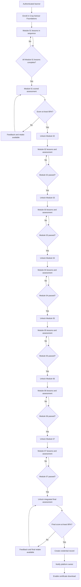

# Crop Advisor Foundations: Training Design Package

**Author:** Manus AI  
**Version:** 1.4  
**Delivery format:** LMS-ready Markdown specification with matching application implementation

## Purpose and learner outcome

Crop Advisor Foundations is an eight-hour, self-paced professional learning pathway for agricultural practitioners who need a repeatable approach to field observation, soil context, crop diagnosis, vegetable-production planning, cost planning, crop-and-variety selection, crop-yield factors, and defensible recommendation-making. The programme is designed around applied judgement rather than product selection. Learners proceed through seven required modules, complete scored module assessments, and then pass an integrated final assessment before a credential is issued.

> **Credential standard:** A learner must complete every lesson, pass each module assessment, and score at least **80%** on the final integrated assessment before a certificate is created.

## Module architecture

| Module | Professional capability | Learning objectives | Lessons | Gate to next requirement |
|---|---|---|---|---|
| **01. Advisory practice** | Turning a field observation into transparent, risk-aware advice. | Distinguish observations, interpretations, and recommendations; define the evidence needed for a field question; keep a traceable recommendation record; recognise when escalation is appropriate. | **Observe, frame, decide**; **Stewardship, records, and risk** | Both lessons complete and module check passed at 80% or above. |
| **02. Soil and nutrition** | Interpreting soil context and collecting representative evidence. | Relate rooting and water conditions to crop performance; identify field zones; design a representative sample; state the assumptions behind nutrient advice. | **Read the soil profile in context**; **From sampling to recommendation** | Both lessons complete and module check passed at 80% or above. |
| **03. Crop observation** | Scouting by growth stage and diagnosing field variability. | Prioritise field observations by crop stage; separate incidence from severity; test competing explanations; communicate certainty proportionately. | **Scout by growth stage**; **Diagnose field variability** | Both lessons complete and module check passed at 80% or above. |
| **04. Vegetable production planning** | Building a whole-system vegetable plan from farm context and site appraisal. | Identify the climatic, edaphic, topographic, economic, biological, and knowledge factors affecting the plan; develop a rich picture; turn site evidence into crop, layout, irrigation, and checklist decisions. | **Build the rich picture**; **Turn a site appraisal into a field plan** | Both lessons complete and module check passed at 80% or above. |
| **05. Cost planning and decisions** | Turning a field objective into a resource, cost, return, and revision decision. | Define a measurable production objective; estimate crop-scale and activity needs; compute input quantities and locally relevant costs; compare plausible returns with costs and revise a weak plan. | **Set objectives and map activities**; **Compute costs and test returns** | Both lessons complete and module check passed at 80% or above. |
| **06. Crop and variety selection** | Choosing a crop and variety through family, rotation, market, site, season, and farmer-participation criteria. | Identify major crop families; use rotation to reduce repeat-crop risks; define buyer preference; test local adaptability; agree a selection with the farmer using reliable information. | **Use crop families to plan rotation**; **Match variety to market and site** | Both lessons complete and module check passed at 80% or above. |
| **07. Factors affecting crop yield** | Relating seed genetics, climate, soil, and topography to yield potential and adaptation. | Distinguish genetic from environmental factors; choose seed traits for an objective; identify climatic, edaphic, and topographic factors; use their interaction to plan adaptation. | **Match seed genetics to the production goal**; **Read environmental yield factors** | Both lessons complete and module check passed at 80% or above. |

Each lesson contains a short applied introduction, three substantial content sections, an explicit learning-outcome panel, a field-practice callout, contextual navigation, and a completion control. The interface preserves the lesson order within a module and gives learners a visible record of completion.

## Authored lesson content map

| Lesson | Granular outline | Applied learning cue |
|---|---|---|
| **Observe, frame, decide** | Start with a decision-focused field question; compare affected and unaffected zones; create an auditable recommendation. | Record what is seen, where it occurs, and how it varies before explaining why it happened. |
| **Stewardship, records, and risk** | Keep a complete advisory record; identify operational and stewardship constraints; close the loop with follow-up. | State the conditions that would cause a recommendation to change. |
| **Read the soil profile in context** | Inspect rooting and soil structure; separate distinct management zones; identify dominant limits before recommending nutrients. | Pair laboratory data with field description of roots and water conditions. |
| **From sampling to recommendation** | Design a sample for the decision; protect sample integrity; explain recommendation assumptions and checks. | Sampling error can be a larger practical risk than small laboratory-number differences. |
| **Scout by growth stage** | Use crop stage to plan visits; walk for field contrast; distinguish incidence from severity. | Link stage, distribution, incidence, severity, and plausible driver. |
| **Diagnose field variability** | Use spatial pattern as a clue; test competing explanations; communicate diagnostic certainty honestly. | A diagnosis should be a transparent argument that links evidence to the next decision. |
| **Build the rich picture** | Map the farm system through climatic, edaphic, topographic, economic, biological, and knowledge lenses. | Planning is strongest when the field is understood as a production-and-market system, not as soil alone. |
| **Turn a site appraisal into a field plan** | Appraise location, history, soil, water, slope, sun, wind, crop choice, layout, and production purpose before agreeing a plan. | Make the plan with the farmer, using a visible map or crop planner and an activity record. |
| **Set objectives and map activities** | Define crop, area, and season; convert crop-guide density into a plant estimate; list tasks, resources, and timing across the crop cycle. | A cost estimate is only as useful as the production objective and field area on which it is based. |
| **Compute costs and test returns** | Derive input quantities from a layout, price materials and resources, estimate a realistic return, and review a weak plan. | Use whole, workable resource units and record the cost-and-return decision for later improvement. |
| **Use crop families to plan rotation** | Identify major vegetable families and apply family relationships to crop rotation and risk management. | Crop and variety selection should fit both the market opportunity and the risk profile of the field and season. |
| **Match variety to market and site** | Test buyer preferences, environmental adaptability, elevation, season, farmer experience, and supplier information before choosing. | Make the buyer’s preferred product characteristics explicit before purchasing seed. |
| **Match seed genetics to the production goal** | Contrast open-pollinated and hybrid seed systems, seed saving, and production-relevant genetic traits. | High-potential seed must still fit the production objective, environment, and management context. |
| **Read environmental yield factors** | Connect climate, soil, and topographic elements with crop yield and adaptation choices. | Environmental interpretation should lead to a practical management decision, not a generic description of conditions. |

## Assessment package

The assessment design uses unambiguous, single-best-answer multiple-choice items with applied field contexts. Immediate feedback explains why the selected response was right or why another action should be taken. A learner can retake an assessment after reviewing the feedback; passing status is retained for progression.

| Assessment | Scope | Items | Pass mark | Decision rule |
|---|---:|---:|---:|---|
| **Advisory practice check** | Field pattern comparison, record traceability, appropriate escalation. | 3 | 80% | Unlocks Soil and nutrition only after both Module 01 lessons are complete and the check is passed. |
| **Soil and nutrition check** | Root-zone context, management-zone sampling, prevention of sampling bias. | 3 | 80% | Unlocks Crop observation only after both Module 02 lessons are complete and the check is passed. |
| **Crop observation check** | Growth-stage scouting, interpreting spatial patterns, evidence-limited diagnosis. | 3 | 80% | Unlocks the integrated final assessment only after both Module 03 lessons are complete and the check is passed. |
| **Vegetable production planning check** | Rich-picture purpose, seasonal hazard planning, edaphic appraisal, and translating site evidence into an agreed field plan. | 4 | 80% | Unlocks the integrated final assessment only after both Module 04 lessons are complete and the check is passed. |
| **Cost planning and decisions check** | Measurable objectives, bed calculations, seedling-loss allowance, and review of a weak financial plan. | 4 | 80% | Unlocks the integrated final assessment only after both Module 05 lessons are complete and the check is passed. |
| **Crop and variety selection check** | Crop-family rotation, buyer preference, environmental adaptability, and farmer participation in selection. | 4 | 80% | Unlocks the integrated final assessment only after both Module 06 lessons are complete and the check is passed. |
| **Factors affecting crop yield check** | Seed systems and genetic traits; climatic, edaphic, and topographic factors; adaptation to yield risk. | 4 | 80% | Unlocks the integrated final assessment only after both Module 07 lessons are complete and the check is passed. |
| **Final integrated assessment** | Advisory sequence, soil context, management-zone evidence, uncertainty management, whole-system vegetable planning, cost-based revision decisions, crop-and-variety selection, and genetic-environmental yield fit. | 8 | 80% | Issues certificate after a pass; a new certificate event triggers an owner notification. |

### Scoring rubric

| Result band | Score | System outcome | Learner feedback pattern |
|---|---:|---|---|
| **Requirement met** | 80–100% | Assessment completion is recorded. The relevant next activity is unlocked. For a final-assessment pass, a certificate is issued. | Confirm applied competence and direct the learner to the next requirement or certificate. |
| **Review and retry** | 0–79% | Assessment attempt is recorded, but the gate remains closed. Retakes remain available. | Identify the concept that needs review and return the learner to the relevant learning route. |

## Final test blueprint

| Item objective | Scenario focus | Evidence of mastery | Correct decision construct |
|---|---|---|---|
| **Integrate crop and soil evidence** | Pale cereal in a poorly drained depression. | Identifies plant, root, soil, moisture, and management evidence required before intervention. | Compare root and soil condition, water status, healthy plants, and history. |
| **Sequence advisory practice** | General field-advisory decision. | Orders observation, decision framing, evidence collection, constrained advice, and follow-up. | Use the complete evidence-led advisory sequence. |
| **Represent a management zone** | Soil sampling across distinct field positions. | Connects sample design with a spatially specific decision. | Keep distinct zones separate when management may differ. |
| **Manage uncertainty proportionately** | Plausible but incompletely evidenced diagnosis. | Chooses verification or specialist input before a high-consequence action. | State uncertainty and seek decisive evidence or expertise. |
| **Plan a vegetable field as a system** | Small-commercial vegetable demonstration planning. | Connects rich picture, climate, soil, water, access, market, biological pressure, farmer capability, crop choice, and layout. | Complete the site appraisal before agreeing crop and field-plan decisions. |
| **Revise a financially weak vegetable plan** | Quantified production plan with lower likely return than estimated cost. | Uses the cost-and-return comparison to decide whether to reduce avoidable costs, change strategy, or defer the plan. | Review the plan and its assumptions before committing resources. |
| **Select a variety through evidence** | Market demand for a cultivar with uncertain local performance. | Balances buyer requirements with local season, elevation, reliable supplier information, and farmer experience. | Agree a variety only after market acceptability and local adaptability have both been tested. |
| **Match yield potential to the field** | A high-potential hybrid considered for a field with slope, moisture, and wind variation. | Relates seed traits to interacting climate, soil, and topographic risks before recommendation. | Assess genetic potential and environmental fit together before agreeing crop and management decisions. |

## Certificate template specification

The certificate is presented within the credential route and can be downloaded as a vector SVG file. Its visual treatment uses a formal cream substrate, deep-green double-rule border, institute emblem, credential seal, issue date, final score, and a unique verification-ready credential identifier.

| Customization field | Source | Display position |
|---|---|---|
| **Recipient name** | Authenticated learner profile | Primary certificate line |
| **Credential title** | Course configuration | Credential statement |
| **Final assessment score** | Passed final-assessment attempt | Credential evidence line |
| **Issue date** | Certificate creation timestamp | Credential evidence line |
| **Credential ID** | Generated at issuance | Verification line and filename |

## Progression and assessment logic

## Platform UI and UX direction

The implemented visual system is a **quiet agrarian academy**. It uses deep field green as the authority colour, soft sage as the learning-support colour, cream as the reading surface, and restrained soil-gold as a credential and gated-state accent. Typography pairs an editorial serif for learning and credential hierarchy with a highly legible sans serif for dense guidance, navigation, and assessment feedback.

| Element | Implementation guidance |
|---|---|
| **Navigation** | Persistent top navigation maintains access to Dashboard, Curriculum, and Credential routes. Every subpage provides an explicit path back to the dashboard or learning route. |
| **Progress** | Module cards, a completion ring, and a next-required-activity panel make the learner’s state legible without turning the platform into a game. |
| **Gates** | Locked states use a warm, restrained lock icon and direct explanation of the prerequisite; they do not obscure what is required. |
| **Assessment feedback** | Results distinguish pass versus review-and-retry, show score and correct-count evidence, then give item-level feedback. |
| **Accessibility** | Buttons are semantic controls, keyboard reachable, and maintain focus indicators. Visual states are reinforced with text and icons rather than colour alone. |
| **Responsive behaviour** | The desktop three-column lesson view folds to a single instructional sequence on mobile while retaining module navigation and completion controls. |

## Data and operational workflow

The platform persists enrollment, individual lesson completion, assessment attempts, and issued certificates. Assessment availability is calculated from stored completion and passing records rather than trusting client-side navigation. A final assessment pass creates a single certificate for the learner-course pair and marks the enrollment complete. On first issuance only, the server sends the platform owner an operational alert containing the learner name, score, and credential ID.

## Document conversion record

Module 04 is derived from the supplied *Importance of Planning in Vegetable Production* training document. Its instructional structure retains the document’s rich-picture method, the six planning-factor lenses, the field-appraisal sequence, the distinction between small commercial fields and home gardens, and the use of practical checklists. The platform renders the source themes as two adult-learning lessons, four applied assessment items, a module gate, and one final-assessment item. [1]

Module 05 is derived from the supplied *Cost Planning and Decision Making in Vegetable Production* training document. Its instructional structure retains the source sequence of defining a production objective, identifying crop-cycle tasks, mapping resources and their timing, calculating quantities and costs, estimating yield and returns, testing potential benefit, and reviewing a plan whose costs are too high. The platform renders these themes as two adult-learning lessons, four applied assessment items, a module gate, and one final-assessment item. [2]

Module 06 is derived from the supplied *Choosing a Crop and Variety to Plant* training document. Its instructional structure retains the document’s market-acceptability criteria, adaptability and elevation checks, farmer participation, major vegetable-family examples, and crop-rotation rationale. The platform renders these themes as two adult-learning lessons, four applied assessment items, a module gate, and one final-assessment item. [3]

Module 07 is derived from the supplied *Overview of Factors Affecting Crop Yield* training document. Its instructional structure retains the distinction between genetic and environmental factors, the open-pollinated and hybrid seed comparison, genetic trait selection, climatic-edaphic-topographic yield elements, and climate-adaptation purpose. The platform renders these themes as two adult-learning lessons, four applied assessment items, a module gate, and one final-assessment item. [4]

## References

[1] [REVISED_ECN-001. *Importance of Planning in Vegetable Production* (user-supplied training document, 4 March 2023)](file:///home/ubuntu/upload/REVISED_ECN-001.ImportanceofPlanninginVegetableProduction_04032023.pdf)

[2] [REVISED_ECN-002. *Cost Planning and Decision Making in Vegetable Production* (user-supplied training document, 5 April 2023)](file:///home/ubuntu/upload/REVISED_ECN-002.CostPlanningandDecisionMakinginVegetableProduction_04052023.pdf)

[3] [REVISED_ECN-003. *Choosing a Crop and Variety to Plant* (user-supplied training document, 10 April 2023)](file:///home/ubuntu/upload/REVISED_ECN-003.ChoosingaCropandaVarietytoPlant_04102023.pdf)

[4] [REVISED_ENV-001. *Overview of Factors Affecting Crop Yield* (user-supplied training document, 21 February 2023)](file:///home/ubuntu/upload/REVISED_ENV-001.OverviewofFactorsAffectingCropYield_022123.pdf)
